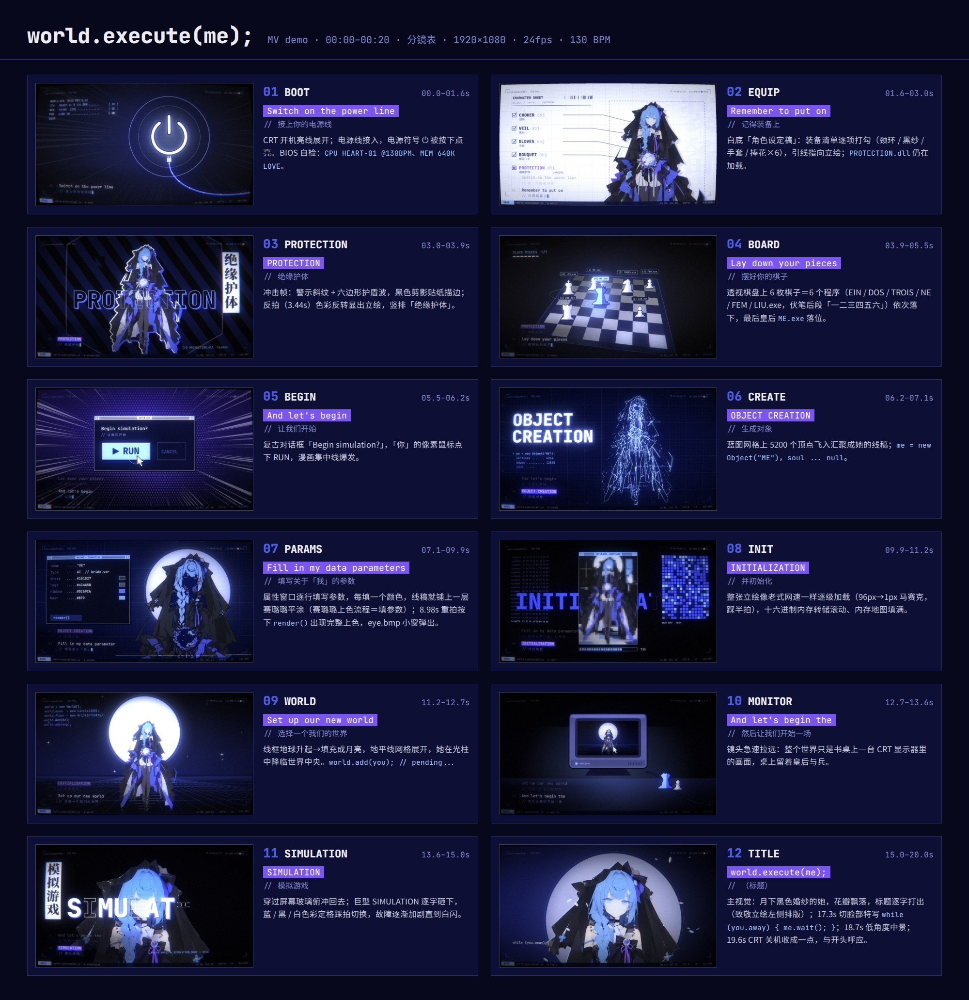

# world.execute(me); — MV（完整版 3:29）

Mili《world.execute(me);》的同人 MV。主角是提供的立绘（蓝发、黑色婚纱、捧花的 AI 少女），
风格为 **日本独立动画 × 实验性赛璐璐插画 × 复古计算机视觉**，歌词以等宽代码格式中英对照打出。



## 创作思路

- **歌词＝源代码**：每句歌词是编辑器里的一行（行号 / 英文 / `// 中文注释` / 光标），关键词（PROTECTION、OBJECT CREATION…）作为常量高亮并从乱码中解码出现；中英文字符严格对齐在等宽网格上（汉字占两格）。
- **黑色婚纱＝婚礼与葬礼**：爱与「EXECUTION（执行 / 死刑）」的双关，贯穿全片的月亮取自立绘背景。
- **赛璐璐上色流程＝填参数**：「Fill in my data parameters」一段里，属性窗口每填一个颜色，线稿就铺上一层平涂，按下 `render()` 才完成上色。
- **伏笔**：棋盘上的 6 枚棋子是 6 个程序 `EIN / DOS / TROIS / NE / FEM / LIU.exe`，对应后段「一二三四五六」的删除；`world.add(you); // pending...`、`while (you.away) { me.wait(); }` 暗示使用者的离开。
- **首尾呼应**：以 CRT 开机亮线开场，以 CRT 关机收成一点结束。
- **节奏**：曲速实测 130 BPM（首拍 0.21s），所有剪辑点、闪光、落子、马赛克分级都卡在拍点 / 半拍上；角色动作「一拍二」（12fps）保留手绘动画的顿挫感。


## 完整版分镜

| 时间 | 歌词 | 画面 |
| --- | --- | --- |
| 0:00–0:21 | 第一段主歌 + 标题 | 试作 demo 部分（开机、设定稿、棋盘、生成、上色、加载、月亮世界、标题） |
| 0:21–0:30 | （间奏） | 桌面系统：「你」依次打开 EIN/DOS/TROIS 三个程序，me.exe 在角落闲置计时；最后才双击 me.exe |
| 0:30–0:44 | 点 / 圆 / 正弦 / 无穷 | 5200 个点从散点组成她并获得 z 轴 → 圆规画圆、圆滚出 2πr → 示波器正弦波，你的光标坐在切线上 → ∞ 越跑越快，渐近线 y = you，四面墙合拢成牢笼 |
| 0:44–0:59 | 电流 / 蒙眼 / 晕眩 / 穿越 / 合一 | AC/DC 拨杆与示波器 → 眼睛特写被涂黑、NO SIGNAL → 旋涡 → 时间轴倒放到公元前 → me ∩ you → me ∪ you → 无限嵌套下潜 |
| 0:59–1:14 | 刺激 / 满足 / 执行 / 被困 | 通知弹窗淹没桌面 → 只剩她自己的满意度问卷（五星是她自己点的）→ LED 笑脸 → 第一次出现红色的 EXECUTION → 显示器里的她被栅栏隔开 |
| 1:14–1:29 | 茄子 / 番茄 / 花猫 / 神 | 像素茄子 + 营养成分表 → 像素番茄 + 抗氧化分子式 → 呼噜的像素花猫 → 光环、六枚棋子朝拜、形式证明「∴ ∃ me ∎」 |
| 1:29–1:44 | 性别 / 早晚 / 角色 / 恍惚 | ♀→♂ 与单选框 → 房间窗外日升日落、钟表 AM→PM → S/M 角色卡翻面（皇后被缎带缠住）→ 屏幕套屏幕的无限隧道 |
| 1:44–1:58 | 振动 / 完成 / 你离开了 / 孤独 | 地震仪记录你的鼠标颤动 → love.dll 安装 99%→100%，全片最幸福的一帧 → 空转的椅子、离线日志、变凉的咖啡、停在原地的光标、她的眼睛（逐渐褪色）→ 无尽网格上的一个像素小人 |
| 1:58–2:13 | 碎片 / 失望 / 挑战神 / 非法参数 | 磁盘碎片整理：删掉其他程序的数据块 → 像素心跳变弱后裂开 → 管理员权限弹窗，她自己按下 Allow → 错误窗口雪崩 |
| 2:13–2:28 | （间奏） | 棋盘上皇后移动，六枚棋子逐一被红色准星锁定 → 任务管理器，End Process，穿插红色的眼睛 |
| 2:28–2:42 | EXECUTION ×12 / EIN…LIU | 12 次重拍各一种构图（前 8 次「执行」，后 4 次「死刑」）→ 每一拍炸掉一个程序图标，一二三四五六 → 死刑 |
| 2:42–2:57 | 最后的副歌 | 清空回收站 → 桌面只剩 me.exe「users logged in: 0」→ `while (!you.back) execute(me);` → 黑暗中显示器里被困的她 |
| 2:57–3:12 | 爱 | 训练 love 模型的 loss 曲线 → 所有问题的答案都是 love → 心形线方程绘出爱心 → 窗户打开，你的光标飞走 → 她被心形的栅栏困住 |
| 3:12–3:29 | （尾奏）EXECUTION… | 卸载对话框，她的光标在 No 与 Yes 间犹豫后按下 Yes → 创作过程倒放：上色 → 平涂 → 线稿 → 点，散成星空 → 空无一人的月下世界，「EXECUTION...」→ CRT 关机 → `process exited with code 0` |

立绘只在关键节点出场（开场、打开 me.exe、神、完成、被困、爱、卸载），其余段落由歌词本身的意象驱动；
红色只在 EXECUTION 之后逐渐出现，作为叙事上的色彩弧线。

## 目录

| 路径 | 内容 |
| --- | --- |
| `web/js/shots.js` | 0:00–0:21 的 12 个镜头（每个镜头都是时间 t 的纯函数） |
| `web/js/act2.js` `act3.js` `act4.js` | 0:21 之后的全部镜头 |
| `web/js/kit.js` | 像素画、桌面系统、房间、对话框、关键词印章等共用元素 |
| `web/js/lyrics.js` | 完整歌词时间轴（中英对照） |
| `web/js/type.js` | 等宽代码排版、歌词时间轴（中英对照） |
| `web/js/post.js` | WebGL2 后期：CRT 曲面、色差、蓝色光晕、扫描线、故障切片、胶片颗粒 |
| `web/js/main.js` | 资源 / 字体加载、HUD（时间码、编辑器状态栏）、`MV.render(t)` |
| `render.mjs` | 无头 Chromium 逐帧渲染 + ffmpeg 合成音频 |
| `tools/prep_assets.py` | 从立绘生成图层：BiRefNet 抠图、Real-ESRGAN 4× 超分、线稿、7 色赛璐璐平涂分层、点云 |
| `web/assets/` | 已生成好的图层（可直接渲染） |

## 渲染

```bash
npm install                       # 字体 + playwright（使用本机已装的 Chromium）
# 需要 ffmpeg 在 PATH 中；歌曲音频不随仓库提供，传入原曲视频或音频文件即可
node render.mjs --audio "Mili-world.execute(me).mp4" --from 0 --to 209 --out out/full.mp4
node render.mjs --stills 3.6,8.4,17.9   # 渲染单帧到 out/stills/
node render.mjs --serve                 # 浏览器实时预览：http://localhost:8123/web/index.html?play
```

输出：1920×1080 / 24fps / H.264 + AAC。时间轴以原曲第一个采样为 0 秒。

重新生成图层（一般不需要）：

```bash
pip install rembg onnxruntime opencv-python-headless pillow numpy scipy onnx
curl -LO https://github.com/xinntao/Real-ESRGAN/releases/download/v0.2.2.4/RealESRGAN_x4plus_anime_6B.pth
python3 tools/esrgan_to_onnx.py RealESRGAN_x4plus_anime_6B.pth .cache/anime6b.onnx
python3 tools/prep_assets.py tools/character_src.webp web/assets
```

音乐：Mili《world.execute(me);》。本仓库只包含 MV 画面的制作代码。
